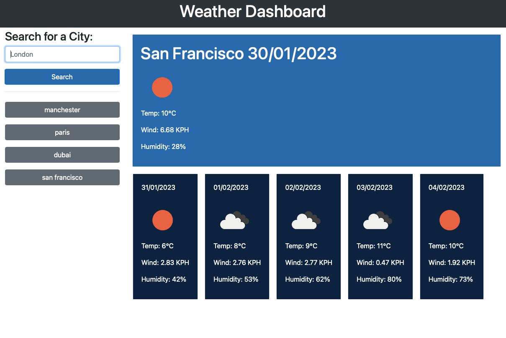

# Weather Dashboard

## Description
The aim of this task is to create a weather dashboard which retrives data from the open weather map api. It will show the weather for today and also the weather for the next 5 days. With each city search a new button will be dynamically created and saved into local storage.

## Mockup
The image below shows an image of the working application.

## Review
This was a fun task to complete as I really enjoyed getting the data from the api and displaying it within the browser. The task was also challanging at the same time as it made me think about how I would need to get the data needed to display correctly onto the page.

## Deployment

[Weather Dashboard - https://wmohammad83.github.io/weather-dashboard/](https://wmohammad83.github.io/weather-dashboard/)

## Resources Used

- [Markdown Badges](https://github.com/Ileriayo/markdown-badges)
- [Google](https://www.google.co.uk)

